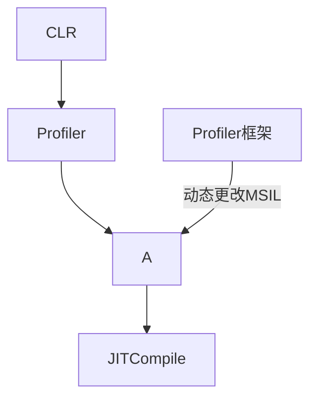

# Modifying IL at Runtime

> Tag:   代码保护  .NET   混淆   Anti逆向   .NET保护的终极目标是即使使用Windbg native调试器也将寸步难行


## Profiling - Unmanaged API

> https://learn.microsoft.com/en-us/dotnet/framework/unmanaged-api/profiling/icorprofilerinfo-setilfunctionbody-method


### GetILFunctionBody

> 获取MSIL代码


```c
HRESULT GetILFunctionBody(  
    [in]  ModuleID    moduleId,  
    [in]  mdMethodDef methodId,  
    [out] LPCBYTE     *ppMethodHeader,  
    [out] ULONG       *pcbMethodSize);
```


### SetILFunctionBody

> ICorProfilerInfo.SetILFunctionBody


> 替换指定模块内指定函数 Body指令  (**IL指令对应的字节码**) 
>
> SetILFunctionBody 被允许调用的前提是  JIT编译器尚未编译此方法

```c
HRESULT SetILFunctionBody(  
    [in] ModuleID    moduleId,  
    [in] mdMethodDef methodid,  // method token
    [in] LPCBYTE     pbNewILMethodHeader);
```


> 使用ICoreProfilerInfo.GetILFunctionBodyAllocator方法分配空间，确保缓冲区兼容


### CLR Profiling

> http://blog.monstuff.com/archives/images/Profiling.pdf

#### 1. Introduction

> Profiling 监控应用程序的性能和内存,在CLR上运行


> Profiler 请求运行时通知它，无论什么时候触发每一个Routine的进入和退出





```c#
// 分析运行在CLR上的程序
public enum ProfileNotifyEvent
{
    CLRStart,
    CLRShutdown,
    AppDomainCreate,
    AppDomainShutdown,
    ModuleLoad,
    // Module what?
    ModuleUnload,
    COMVTableCreate,
    COMVTableDestruction,
    JITCompile,
    CodePitch,
    ClassLoad,
    ClassUnload,
    CreateThread,
    ExitThread,
    SyncThread,
    RoutineEntry,
    RoutineExit,
    Exception,
    // 代码在托管与非托管之间穿梭
    TransitionAcross,
    TransitionRuntimeContext,
    CLRSuspendInfo,
    CLRHeapGCInfo
}
```


#### Example

> [ICorProfilerInfo](https://github.com/ABaboshin/DotNetCoreProfiler/blob/1421bb265317e23c447d5087e4739a9ae9fdc9ba/src/profiler/rewriter/ILRewriter.h)


> JITCompilationStarted


## Metadata UnmanagedAPI

> Native方式访问元数据


## Reference

> http://blog.monstuff.com/archives/000058.html
>
> http://blog.monstuff.com/archives/000059.html
>
> http://blog.monstuff.com/archives/000060.html
>
> http://blog.monstuff.com/archives/000077.html


> https://www.mail-archive.com/dotnet-rotor@discuss.develop.com/msg00510.html
>
> Get/SetILFunctionBody


> http://blog.monstuff.com/archives/images/Profiling.pdf


> https://github.com/ABaboshin/DotNetCoreProfiler/blob/1421bb265317e23c447d5087e4739a9ae9fdc9ba/src/profiler/rewriter/ILRewriter.h
>
> https://github.com/ABaboshin/DotNetCoreProfiler/


> http://blog.monstuff.com/archives/images/Metadata_Umanaged_API.pdf